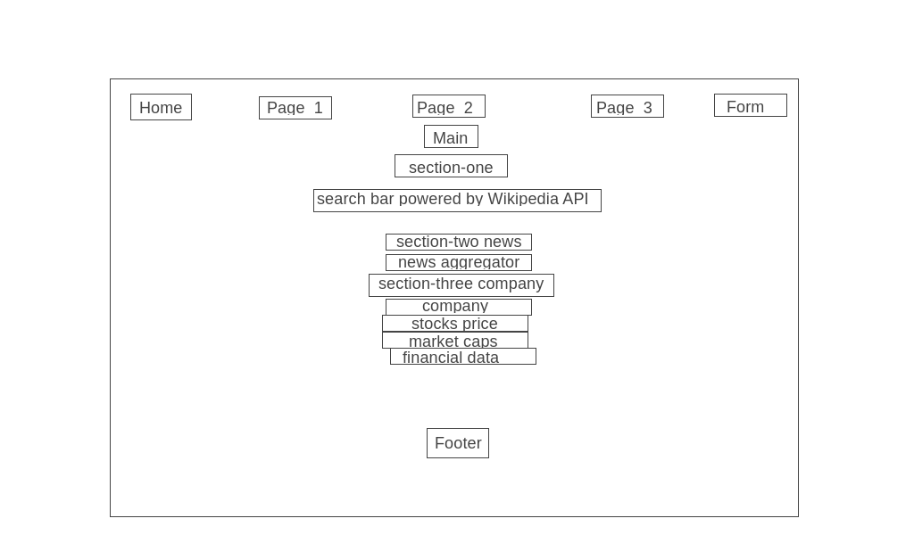

# Profile_Project_2
## Overview
Plan: To attempt to make a project with:
    - three sections in main:
        -section one
            - a search bar using Wikipedia's search API
        -section two
            - news
                - a news aggregator with rolling queue of information relevant to company searched
        - section three
            - company information
                - delayed updating stock prices
                - market cap for the company at hand
                - other relevant financial data for the company
    - other ideas:
        - section four
            - spreadsheet calculator for doing simple analysis of the company selected.
        - integrate all sections so that once a company is searched, the website updates with all relevant information in all sections at the same time

## Wireframe

## References

-

testing 2